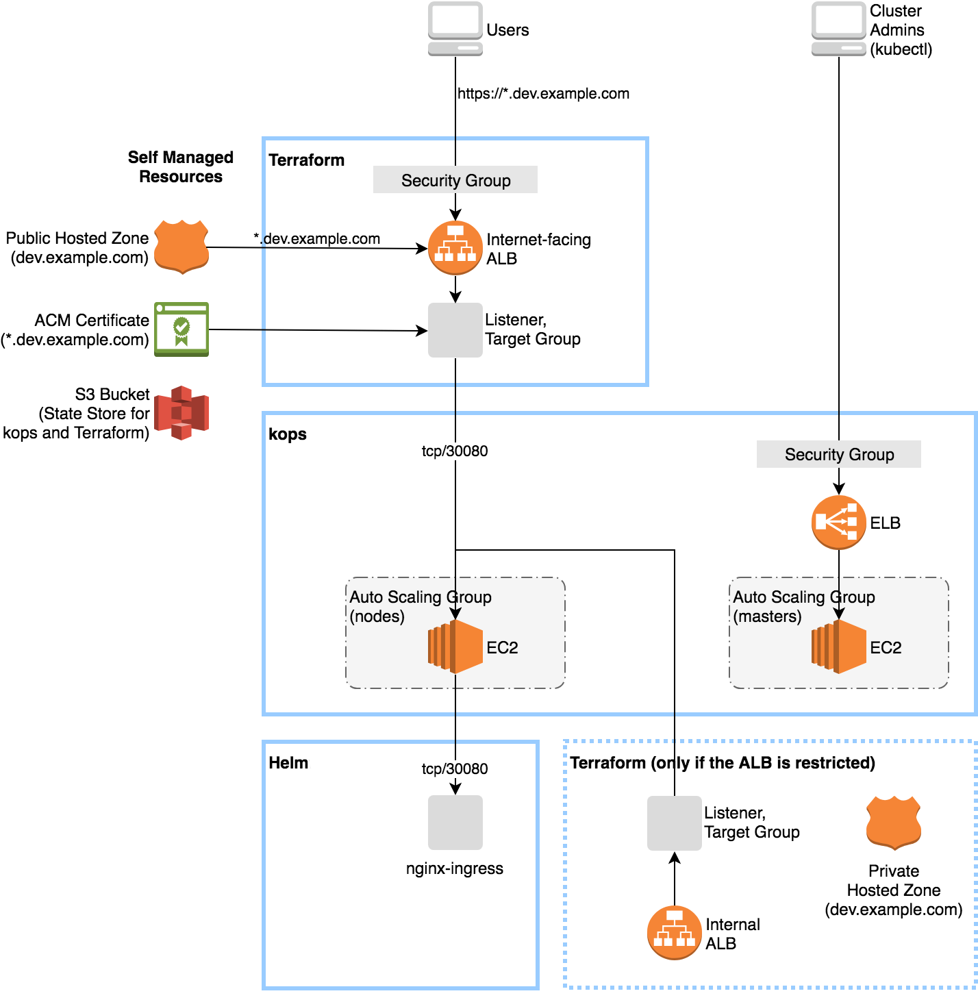

# Kubernetes on AWS with kops and Terraform

This bootstraps the following stack in a few minutes:



## Goals

- Expose services via HTTPS using [nginx-ingress](https://github.com/kubernetes/charts/tree/master/stable/nginx-ingress), NodePort, ALB, ACM and Route53.
- Bootstrap a cluster by the script.
- Manage the cluster using `kubectl`, `helm`, `kops` and `terraform`.


## Build a new cluster

Make sure you have the following items:

- An AWS account
- An IAM user with [these permissions](https://github.com/kubernetes/kops/blob/master/docs/aws.md)
- A domain or subdomain, e.g. `dev.example.com`

Install the following tools:

```sh
# WSL/Ubuntu
sudo apt install awscli
./install.sh   # Install kubectl, kops, helm, and terraform
```


### 1. Configure

Kube-bootstrapper supports different cluster config for different environments. All envs are maintained in envs directory.
To get started dev envirnoment is provided. In envs/dev/variables.sh file replaces values with in <<>> to appropriate values.
Now Load the values with following command.

```sh
source envs/{{environement}}/variables.sh # dev incase of local in this case
```

Configure your AWS credentials.

```sh
aws configure --profile "$AWS_PROFILE"
```


### 2. Setup

#### 2-1. Route53

Create a public hosted zone for the domain:

```sh
aws route53 create-hosted-zone --name "$kubernetes_ingress_domain" --caller-reference "$(date)"
```

You may need to add the NS records to the parent zone.


## Configure DNS

Note: If you are using Kops 1.6.2 or later, then DNS configuration is
optional. Instead, a gossip-based cluster can be easily created. The
only requirement to trigger this is to have the cluster name end with
`.k8s.local`. If a gossip-based cluster is created then you can skip
this section.

In order to build a Kubernetes cluster with `kops`, we need to prepare
somewhere to build the required DNS records.  There are three scenarios
below and you should choose the one that most closely matches your AWS
situation.

### Scenario 1a: A Domain purchased/hosted via AWS

If you bought your domain with AWS, then you should already have a hosted zone
in Route53.  If you plan to use this domain then no more work is needed.

In this example you own `example.com` and your records for Kubernetes would
look like `etcd-us-east-1c.internal.clustername.example.com`

### Scenario 1b: A subdomain under a domain purchased/hosted via AWS

In this scenario you want to contain all kubernetes records under a subdomain
of a domain you host in Route53.  This requires creating a second hosted zone
in route53, and then setting up route delegation to the new zone.

In this example you own `example.com` and your records for Kubernetes would
look like `etcd-us-east-1c.internal.clustername.subdomain.example.com`

This is copying the NS servers of your **SUBDOMAIN** up to the **PARENT**
domain in Route53.  To do this you should:

* Create the subdomain, and note your **SUBDOMAIN** name servers (If you have
  already done this you can also [get the values](ns.md))

```bash
# Note: This example assumes you have jq installed locally.
ID=$(uuidgen) && aws route53 create-hosted-zone --name subdomain.example.com --caller-reference $ID | \
    jq .DelegationSet.NameServers
```

* Note your **PARENT** hosted zone id

```bash
# Note: This example assumes you have jq installed locally.
aws route53 list-hosted-zones | jq '.HostedZones[] | select(.Name=="example.com.") | .Id'
```

* Create a new JSON file with your values (`subdomain.json`)

Note: The NS values here are for the **SUBDOMAIN**

```
{
  "Comment": "Create a subdomain NS record in the parent domain",
  "Changes": [
    {
      "Action": "CREATE",
      "ResourceRecordSet": {
        "Name": "subdomain.example.com",
        "Type": "NS",
        "TTL": 300,
        "ResourceRecords": [
          {
            "Value": "ns-1.awsdns-1.co.uk"
          },
          {
            "Value": "ns-2.awsdns-2.org"
          },
          {
            "Value": "ns-3.awsdns-3.com"
          },
          {
            "Value": "ns-4.awsdns-4.net"
          }
        ]
      }
    }
  ]
}
```

* Apply the **SUBDOMAIN** NS records to the **PARENT** hosted zone.

```
aws route53 change-resource-record-sets \
 --hosted-zone-id <parent-zone-id> \
 --change-batch file://subdomain.json
```

Now traffic to `*.subdomain.example.com` will be routed to the correct subdomain hosted zone in Route53.

### Scenario 2: Setting up Route53 for a domain purchased with another registrar

If you bought your domain elsewhere, and would like to dedicate the entire domain to AWS you should follow the guide [here](http://docs.aws.amazon.com/Route53/latest/DeveloperGuide/domain-transfer-to-route-53.html)

### Scenario 3: Subdomain for clusters in route53, leaving the domain at another registrar

If you bought your domain elsewhere, but **only want to use a subdomain in AWS
Route53** you must modify your registrar's NS (NameServer) records.  We'll create
a hosted zone in Route53, and then migrate the subdomain's NS records to your
other registrar.

You might need to grab [jq](https://github.com/stedolan/jq/wiki/Installation)
for some of these instructions.

* Create the subdomain, and note your name servers (If you have already done
  this you can also [get the values](ns.md))

```bash
ID=$(uuidgen) && aws route53 create-hosted-zone --name subdomain.example.com --caller-reference $ID | jq .DelegationSet.NameServers
```

* You will now go to your registrar's page and log in. You will need to create a
  new **SUBDOMAIN**, and use the 4 NS records received from the above command for the new
  **SUBDOMAIN**. This **MUST** be done in order to use your cluster. Do **NOT**
  change your top level NS record, or you might take your site offline.

* Information on adding NS records with
  [Godaddy.com](https://www.godaddy.com/help/set-custom-nameservers-for-domains-registered-with-godaddy-12317)
* Information on adding NS records with [Google Cloud
  Platform](https://cloud.google.com/dns/update-name-servers)

#### Using Public/Private DNS (Kops 1.5+)

By default the assumption is that NS records are publicly available.  If you
require private DNS records you should modify the commands we run later in this
guide to include:

```
kops create cluster --dns private $NAME
```

If you have a mix of public and private zones, you will also need to include the `--dns-zone` argument with the hosted zone id you wish to deploy in:

```
kops create cluster --dns private --dns-zone ZABCDEFG $NAME
```

## Testing your DNS setup

This section is not be required if a gossip-based cluster is created.

You should now able to dig your domain (or subdomain) and see the AWS Name
Servers on the other end.

```bash
dig ns subdomain.example.com
```

Should return something similar to:

```
;; ANSWER SECTION:
subdomain.example.com.        172800  IN  NS  ns-1.awsdns-1.net.
subdomain.example.com.        172800  IN  NS  ns-2.awsdns-2.org.
subdomain.example.com.        172800  IN  NS  ns-3.awsdns-3.com.
subdomain.example.com.        172800  IN  NS  ns-4.awsdns-4.co.uk.
```

This is a critical component of setting up clusters. If you are experiencing
problems with the Kubernetes API not coming up, chances are something is wrong
with the cluster's DNS.

**Please DO NOT MOVE ON until you have validated your NS records! This is not required if a gossip-based cluster is created.**


#### 2-2. ACM

Request a certificate for the wildcard domain:

```sh
aws acm request-certificate --domain-name "*.$kubernetes_ingress_domain" --validation-method DNS --region {{your region}} # us-east-2 in my case
```

You need to approve the DNS validation.
Open https://console.aws.amazon.com/acm/home and click the "Create record in Route53" button.
See [AWS User Guide](https://docs.aws.amazon.com/acm/latest/userguide/gs-acm-validate-dns.html) for more.


#### 2-3. S3

Create a bucket for state store of kops and Terraform.
You must enable bucket versioning.

```sh
aws s3api create-bucket \
  --bucket "$state_store_bucket_name" \
  --region "$AWS_DEFAULT_REGION" \
  --create-bucket-configuration "LocationConstraint=$AWS_DEFAULT_REGION"
aws s3api put-bucket-versioning \
  --bucket "$state_store_bucket_name" \
  --versioning-configuration "Status=Enabled"
```


### 3. Bootstrap

By default the script will create the following components:

- kops
  - 1 master (t2.medium) in a single AZ
  - 2 nodes (t2.medium) in a single AZ
- Terraform
  - An internet-facing ALB
  - A Route53 record for the internet-facing ALB
  - A security group for the internet-facing ALB
- kubectl
  - Create `ServiceAccount` and `ClusterRoleBinding` for the Helm tiller
  - Patch `StorageClass/gp2` to remove the default storage class
- Helm
  - [`stable/nginx-ingress`](https://github.com/kubernetes/charts/tree/master/stable/nginx-ingress)
  - [`stable/fluent-bit`](https://github.com/helm/charts/tree/master/stable/fluent-bit)

Bootstrap a cluster.

```sh
./bootstrap.sh
```


### 4. Customize

#### 4-1. Change instance type

You can change instance type of the master:

```sh
kops edit ig "master-${AWS_DEFAULT_REGION}a"
```

You can change instance type of the nodes:

```sh
kops edit ig "nodes-${AWS_DEFAULT_REGION}a"
```

Apply the changes:

```sh
kops update cluster
kops update cluster --yes
```


#### 4-2. Restrict access to Kubernetes API and SSH

To change access control for the Kubernetes API and SSH:

```sh
kops edit cluster
```

```yaml
spec:
  kubernetesApiAccess:
  - xxx.xxx.xxx.xxx/32
  sshAccess:
  - xxx.xxx.xxx.xxx/32
```

Apply the changes for the Kubernetes API and SSH:

```sh
kops update cluster
kops update cluster --yes
```


#### 4-3. Restrict access to internet-facing ALB

The following resources are needed so that the masters and nodes can access to services in the VPC:

- An internal ALB
- A Route53 private hosted zone for the internal ALB
- A Route53 record for the internal ALB
- A security group for the internal ALB

To change access control for the internet-facing ALB, edit `tf_config.tf`:

```tf
variable "alb_external_allow_ip" {
  default = [
    "xxx.xxx.xxx.xxx/32",
    "xxx.xxx.xxx.xxx/32",
  ]
}

variable "alb_internal_enabled" {
  default = true
}
```

Apply the changes for the internet-facing ALB:

```sh
terraform apply
```


#### 4-4. OIDC authentication

You can setup OIDC authentication for exposing Kubernetes Dashboard and Kibana.

If you want to use your Google Account, create an OAuth client on [Google APIs Console](https://console.developers.google.com/apis/credentials) and change the client ID and secret in `envs/$environment/variables.sh` as follows:

```sh
export oidc_discovery_url=https://accounts.google.com
export oidc_kubernetes_dashboard_client_id=xxx-xxx.apps.googleusercontent.com
export oidc_kubernetes_dashboard_client_secret=xxxxxx
export oidc_kibana_client_id=xxx-xxx.apps.googleusercontent.com
export oidc_kibana_client_secret=xxxxxx
```

See also the tutorial at [int128/kubernetes-dashboard-proxy](https://github.com/int128/kubernetes-dashboard-proxy).


#### 4-5. Working with managed services

Terraform creates the security group `allow-from-nodes.hello.k8s.local` which allows access from the Kubernetes nodes.


## Manage the cluster

Tell the following steps to your team members.

### On boarding

```sh
source envs/$environment/variables.sh

# Configure your AWS credentials.
aws configure --profile "$AWS_PROFILE"

# Initialize kubectl and Terraform.
./init.sh
```

### Daily operation

```sh
source envs/$environment/variables.sh

# Now you can execute the following tools.
kops
terraform
helm
```


## Destroy the cluster

**WARNING:** `kops delete cluster` command will delete all EBS volumes with a tag.
You should take snapshots before destroying.

```sh
terraform destroy
kops delete cluster --name "$KOPS_CLUSTER_NAME" --yes
```


## Cost

Running cost depends on number of masters and nodes.

### Minimize cost for testing

Here is a minimum configuration with AWS Free Tier (first 1 year):

Role | Kind | Spec | Monthly Cost
-----|------|------|-------------
Master  | EC2 | m3.medium spot | $5
Master  | EBS | gp2 10GB | free
Master  | EBS for etcd | gp2 5GB x2 | free
Node    | EC2 | m3.medium spot | $5
Node    | EBS | gp2 10GB | free
Cluster | EBS for PVs | gp2 | $0.1/GB
Cluster | ALB | - | free
Cluster | Route53 Hosted Zone | - | $0.5
Cluster | S3  | - | free

The cluster name must be a domain name in order to reduce an ELB for masters.

```sh
# envs/$environment/variables.sh
kubernetes_cluster_name=dev.example.com
```

Reduce size of the volumes:

```yaml
# kops edit cluster
spec:
  etcdClusters:
  - etcdMembers:
    - instanceGroup: master-us-west-2a
      name: a
      volumeSize: 5
    name: main
    version: 3.2.14
  - etcdMembers:
    - instanceGroup: master-us-west-2a
      name: a
      volumeSize: 5
    name: events
    version: 3.2.14
---
# kops edit ig master-us-west-2a
spec:
  machineType: m3.medium
  maxPrice: "0.02"
  rootVolumeSize: 10
---
# kops edit ig nodes
spec:
  machineType: m3.medium
  maxPrice: "0.02"
  rootVolumeSize: 10
  subnets:
  - us-west-2a
```


## Contribution

This is an open source software licensed under Apache License 2.0.
Feel free to bring up issues or pull requests.


## Credits

I've modified code from https://github.com/int128/kops-terraform-starter. Thanks to creator.